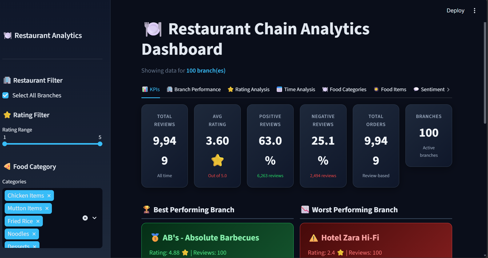
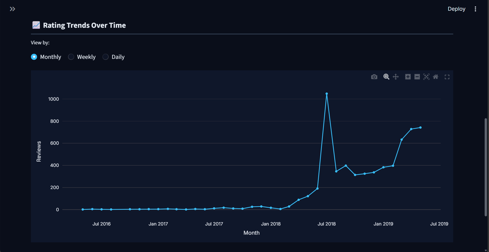
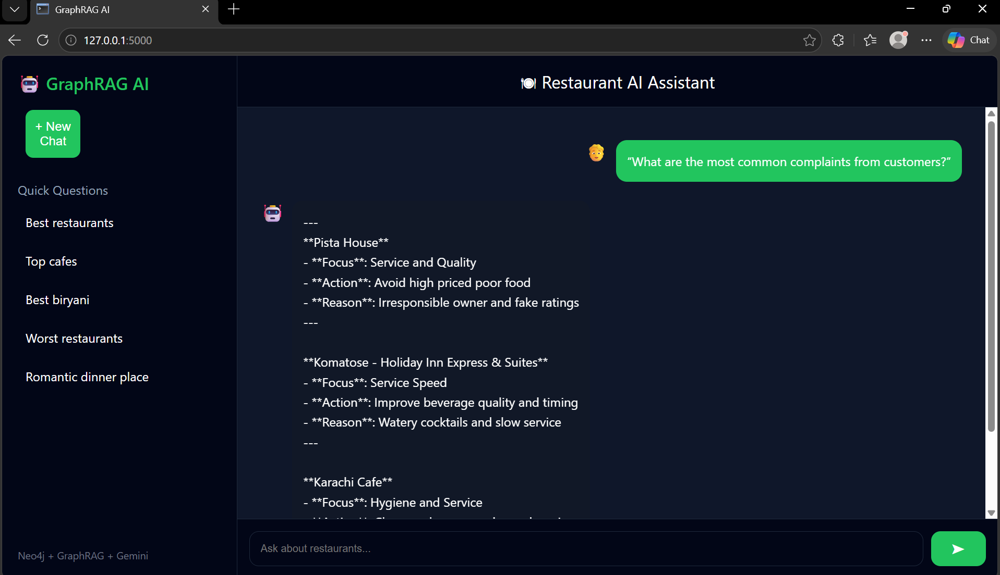

# 🍽️ DineMind — Intelligent Restaurant GraphRAG Analytics

An advanced **Retrieval-Augmented Generation (RAG) and Knowledge Graph system** designed to analyze restaurant reviews, food trends, and business metrics using **semantic search, Neo4j graph relationships, and LLM-powered reasoning**.

---

## 📌 Project Description

This project is a smart AI-driven intelligence system built to transform raw restaurant reviews and data into an **interactive analytics dashboard and conversational system**.

Unlike traditional analytics, this platform allows restaurant managers and owners to **ask natural language questions** and receive **accurate, data-backed insights** derived from a massive database of over 10,000 reviews.

The system integrates structured database relationships with modern AI techniques to answer queries related to:

* Customer sentiment and ratings
* Temporal food trends (Day, Week, Month)
* Category-based menu breakdowns
* Branch performance and issue detection
* Review-driven sales growth proxies

This makes the system a powerful tool for **business intelligence, menu optimization, and operational efficiency**.

## 📸 Application Preview

### 🔹 Analytics Dashboard Interface

### 🔹 Time-Based Food Trends Analysis

### 🔹 Intelligent Chatbot Support

---

## 🚀 Core Features

### 🔍 Intelligent Business Queries
* Understands natural language questions about restaurant performance
* Handles complex analytical queries requiring logical reasoning
* Structures outputs in professional, scannable vertical lists

### 🧠 GraphRAG Retrieval System
* Embeds and connects tabular data into a structured Neo4j Knowledge Graph
* Retrieves relevant context using vector similarity and graph traversals
* Ensures business answers are grounded in 10,000+ real customer reviews

### 📊 Advanced Interactive Dashboard
* 10-tab Streamlit dashboard for comprehensive business insights
* Tracks KPI metrics, sentiment distributions, and rating analysis
* Visualizes temporal food demand patterns (Weekdays vs. Weekends)
* Categorizes menu items into 8 core business dimensions

### 🎯 High-Performance Ingestion Pipeline
* Batch processing architecture for rapid data loading into Neo4j
* Automated schema construction mapping reviews, branches, and food items

### 💬 Interactive Chat Interface
* Streamlit-based chat application
* Maintains reasoning (Chain of Thought) for accurate recommendations
* Explains how business insights were derived from the data

---

## ⚙️ Workflow

Raw Dataset (10,000+ CSV Reviews)
⬇
Batch Ingestion & Graph Modeling 
⬇
Neo4j Knowledge Graph Storage
⬇
Embedding Generation & Vector Indexing
⬇
Hybrid Retrieval (Vector Search + Graph Traversal)
⬇
LLM (OpenAI) Context-Aware Response Generation
⬇
Insightful Analytics Dashboard / Chatbot Output

---

## 🧠 Technologies Used

* **Python** — Core development & data pipelines
* **Neo4j & APOC** — Graph database and data operations
* **OpenAI API** — LLM response generation and conversational reasoning
* **Streamlit** — Interactive Dashboard and Chatbot UI
* **Pandas** — Data processing and structuring
* **LangChain / LlamaIndex** — RAG orchestration tools

---

## 💡 Example Queries

* "Which food categories show the highest sentiment growth over the last quarter?"
* "Compare weekend vs. weekday sales trends for signature dishes."
* "What are the most common issues reported in 1-star reviews for the downtown branch?"
* "List the top 5 performing food items based on review volume."

---

## 🔬 Key Functionalities

### 📌 Knowledge Graph Construction
Maps reviews, dates, locations, and menus into an interconnected semantic graph structure.

### 📌 Hybrid Semantic Search
Uses vector embeddings combined with graph relationships for highly accurate document retrieval.

### 📌 Chain of Thought Analytics
Enforces internal logical analysis within the LLM to provide exact, data-driven answers.

### 📌 Dynamic Business Intelligence
Consolidates raw text into trackable KPIs and time-series analyses.

---

## 🎯 Target Users

* 📈 Restaurant Managers — for operational insights
* 📊 Business Analysts — for trend discovery
* 👨‍🍳 Executive Chefs — for menu optimization
* 🏢 Franchise Owners — for cross-branch comparisons

---

## 📌 Conclusion

This system demonstrates how cutting-edge AI techniques like GraphRAG can convert massive volumes of raw customer feedback into an **interactive, intelligent business intelligence platform**, making operational changes easy and data-driven.
